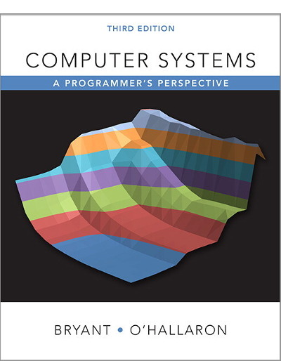

# Computer Systems: A Programmer's Perspective, 3/E (CS:APP3e)

2017.9.13, Start reading ***Computer Systems A Programmer's Perspective Third Edition*** (CS:APP3e)

Here are my histories of studying this course and my solutions for 9 labs in CS:APP3e.

The home page of this course in CMU: [CSAPP CMU](http://csapp.cs.cmu.edu/3e/labs.html)

# Reports

Here in my blog: [A Salted fish's blog](https://zxc479773533.github.io)

# Histories

* 2017.9.13 Start reading CSAPP-3e
* 2017.9.13 Finish reading chapter 1: *A Tour of Computer Systems*
* 2017.9.16 Finish reading chapter 2: *Representing and Manipulating Information*
* 2017.9.20 Finish `Data Lab`.
* 2017.9.20 Finish report of Data Lab.
* 2017.10.7 Finish reading chapter 3: *Machine-Level Representation of Programs*
* 2017.10.14 Finish `Bomb Lab`.
* 2017.10.20 Finish report of Bomb Lab.
* 2017.10.29 Finish `Attack Lab`.
* 2017.10.31 Finish reading chapter 5: *Optimizing Program Performance*
* 2017.11.2 Finish reading chapter 6: *The Memory Hierarchy*
* 2017.11.4 Finish `Performance Lab`.
* 2017.11.9 Finish reading chapter 7: *Linking*